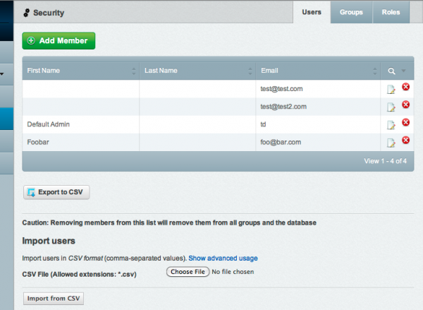
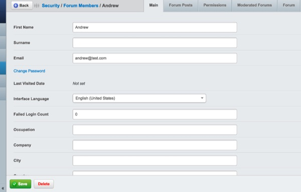
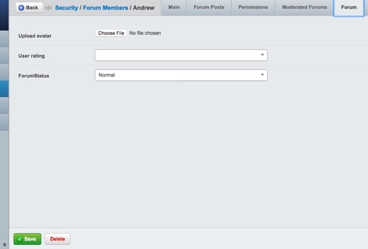
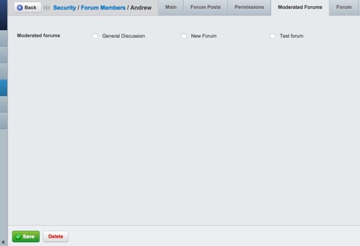

# Forum Administration 

## Topics

### Editing or deleting a previously published post (as an administrator)

If you have administrative access, you may edit or delete any post made by any poster, by browsing to that point and hitting the "Edit" or "Delete" links respectively.

### Making threads sticky

To make a thread "sticky," that is, to make sure it always appears at the top of the topic listings for the forum, click the checkbox next to "Is this a sticky thread?" and hit Save.

To make a sticky thread global - that is, to make sure it always appears at the top of every topic listing on every forum on your site, click the checkbox next to "Is this a Global Sticky" as well, and hit Save.
Locking threads as read only

To prevent people from making changes to a topic, (also known as "locking" a topic), click the checkbox next to "Is this a Read only Thread?" and hit Save.

### Changing thread forums

To move a topic from one forum to another, browse to the topic in question, and choose the forum you wish to move the thread to under the "Change Thread Forum" drop-down box, and hit Save.

## Users

To administrate users, make sure you are in the CMS "backend" for administration, and press the "Security" navigation tab. This should give you a list of all the users that have registered on the forum or website. 

### Deleting user accounts

To delete a user account, click on the red "X" icon next to the username for the account. This will remove the account from the forum and website, and the user will not be able to log in using that name again. 

### Assigning moderation responsibilities to users

To assign moderation responsibilities, click on the "edit" icon next to the username for the account. This will bring up the profile of the user.

Click on the "Forum" tab in the user profile, and change the "User Rating" drop-down menu to "Moderator." Hit Save.

Click on the "Moderated Forums" tab in the user profile, and place a checkmark next to any forums the user will be given moderation access to. Hit Save.

After you are done, click the "security" link in the breadcrumbs at the top of the screen and it will take you back to the list of users.

### Notes:

While this limited information will suffice for forum administration, administrating users across your SilverStripe site is done inside the 'Security' section of the CMS.

